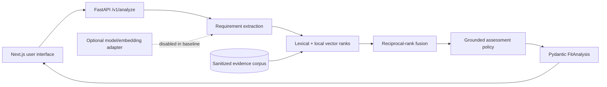

# RoleSignal

RoleSignal evaluates a job description against a citation-backed candidate evidence corpus. It distinguishes what is **supported**, **adjacent**, **missing**, or **unknown**, cites every positive conclusion, and refuses to turn a gap into a résumé claim.

This repository is a public applied-AI engineering case study by Thomas Falcon. It combines a Next.js/TypeScript interface with a typed Python/FastAPI service, hybrid retrieval, structured contracts, automated evaluation, failure-aware UI, and provider adapters.

## What works now

- Paste a job description and analyze a preloaded sanitized Thomas profile.
- Extract and classify requirements as required, preferred, responsibility, domain, compensation, or location.
- Retrieve candidate evidence with local lexical/vector ranks combined through reciprocal-rank fusion.
- Render exact claim and source-locator citations for supported or adjacent assessments.
- Treat compensation and location as human-confirmation items.
- Return missing requirements without fabricated evidence.
- Report latency, estimated model cost, and evidence coverage.
- Validate API requests and responses with Pydantic.
- Run a 30-case retrieval set and grounding tests in CI.

The default is a **deterministic, zero-cost demo**. It does not call OpenAI and does not pretend that local hashing is a production embedding model. An OpenAI adapter is included behind a narrow interface for the upcoming live retrieval experiment; hosted model use remains disabled until it is integrated into the measured path.

## Measured baseline

| Check | Current result |
|---|---:|
| Golden retrieval cases | 30 |
| Recall@5 | 100% (30/30) |
| Automated tests | 8 passing |
| Python coverage | 90% |
| Known fabricated candidate claims in tests | 0 |
| Hosted model calls in default demo | 0 |

This small, deliberately clear fixture set is a baseline—not a general-quality claim. Week 2 expands it with hard negatives, conflicting evidence, irrelevant retrieval, and paraphrase stress cases, then migrates retrieval to PostgreSQL full-text search plus pgvector.

## Architecture



The current slice uses in-memory analysis retention and repository fixtures so behavior is inspectable. The next persistence slice replaces these with PostgreSQL/pgvector, database migrations, source-locator metadata, and transient public submissions. The browser accepts only a preloaded profile ID; there is no public résumé upload endpoint in v1.

## API contracts

- `POST /v1/analyze` — accepts `job_text` and `candidate_profile_id`; returns requirements, assessments, evidence, limitations, and metrics.
- `GET /v1/analyses/{analysis_id}` — returns an analysis still present in the bounded demo cache.
- `GET /v1/health` — reports the real demo mode, storage state, and provider configuration.
- Interactive OpenAPI docs are available at `/docs` while the API is running.

Core public models live in [`api/models.py`](api/models.py): `CandidateEvidence`, `JobRequirement`, `RequirementAssessment`, and `FitAnalysis`.

## Run locally

Requires Node.js 22+ and Python 3.12+.

```bash
npm ci
python3 -m venv .venv
.venv/bin/pip install -e '.[dev]'
.venv/bin/uvicorn api.main:app --reload --port 8000
```

In a second terminal:

```bash
npm run dev
```

Open `http://localhost:3000`. In development, the web app defaults to
`http://localhost:8000`; set `NEXT_PUBLIC_API_URL` for another API origin.
Production uses the same-origin `/v1` contract, which rewrites to the Vercel
Python function under `/api/v1`.

PostgreSQL with pgvector is available for the Week 2 storage slice:

```bash
docker compose up -d postgres
```

## Verify

```bash
.venv/bin/ruff check .
.venv/bin/mypy api
.venv/bin/pytest --cov=api --cov-report=term-missing
npm run typecheck
npm run build
```

CI runs the TypeScript build and Python test/evaluation lanes independently.

## Privacy and truthfulness

- Public users cannot upload résumés in v1.
- The demo corpus is sanitized and stored as public evidence.
- Submitted job text is processed in memory and is not intentionally persisted; the current bounded analysis cache resets with the process.
- The default demo makes no external model request.
- A positive assessment must include an evidence ID that resolves to a returned citation.
- “Adjacent” means transferable evidence, not proof of the complete requirement.
- Compensation, location, authorization, and current preferences are never inferred from technical evidence.

Do not add employer source code, private documents, private résumé data, or claims that cannot be tied to an inspectable source.

## Delivery roadmap

- **Week 1:** end-to-end deterministic RAG-shaped slice, typed API, public evidence profile, responsive result UI, CI baseline.
- **Week 2:** PostgreSQL/pgvector, full-text search, real embeddings, metadata-aware chunks, 50+ difficult evaluation cases, retrieval and grounding report.
- **Week 3:** structured logs, correlation IDs, provider timeouts/retries, rate limits, prompt-injection cases, cached demo analyses, browser tests.
- **Week 4:** deployed case study, architecture/data-flow/threat-model diagrams, accessibility and performance audit, demo video.

## License and data

Source licensing will be finalized before accepting external contributions. The candidate fixtures may be used to run this project but must not be presented as another person's experience.
