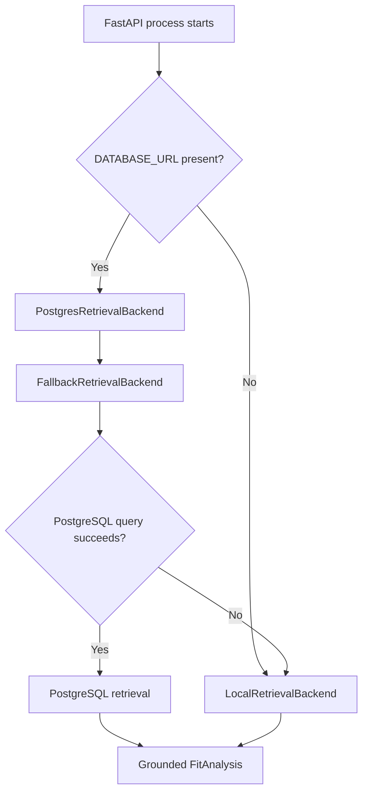
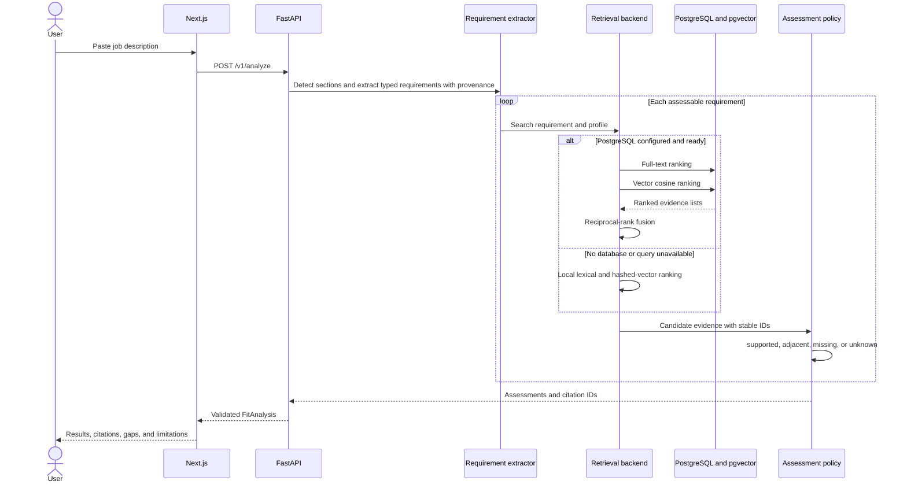
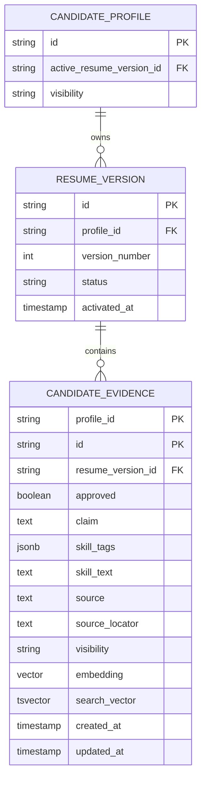
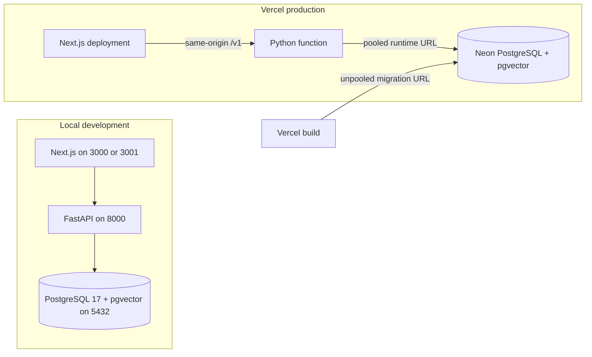

# RoleSignal architecture

RoleSignal separates evidence truth, retrieval, and assessment policy. A retrieval backend may
change how candidate evidence is ranked, but it cannot create candidate claims or convert missing
experience into a positive assessment.

## Runtime selection

The fallback is explicit in `/v1/health`. With a configured and reachable database, the response
reports `postgres-hybrid-with-local-fallback` and `postgres-ready`. Without `DATABASE_URL`, it
reports `deterministic` and `in-memory-demo`.

## Analysis and retrieval flow

## Current profile and evidence data model

Only an active version's approved public evidence participates in retrieval. Active and archived
versions are immutable; editing begins by cloning the active version into a draft. Activation
archives the previous version and moves the profile pointer in one database transaction.

Original-document and parsed-section tables remain deferred until authentication, private object
storage, retention, and deletion behavior are implemented.

## Storage boundaries

| Information | Current storage | Retention |
|---|---|---|
| Sanitized candidate fixtures | Repository JSON; optionally seeded into PostgreSQL | Versioned with the repository |
| Candidate profiles, versions, evidence, embeddings | Neon production; local Docker for development | Persistent database |
| Submitted job description | FastAPI process memory | Request processing only |
| Completed analysis | Bounded process-local cache | Until eviction or process restart |
| Original resume files | Not accepted | None |
| Hosted model input/output | Hosted model calls disabled | None |

## Deployment topology

Preview deployments receive isolated Neon branches. Their Alembic migrations run before the
application build, allowing schema and application changes to be tested together without altering
production. Production follows the same migration gate against its stable Neon branch.
