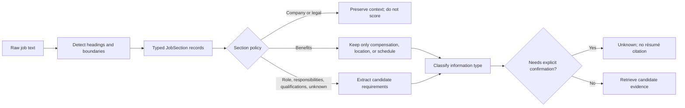

# Section-aware job ingestion

RoleSignal separates document structure from candidate comparison. Company marketing, benefits,
and legal boilerplate must not become candidate requirements merely because they occur before the
qualifications section.

## Pipeline

## Section taxonomy

| Section type | Typical headings | Comparison behavior |
|---|---|---|
| `company_description` | About us, Who we are | Preserved but excluded |
| `position_summary` | The position, The role | Extract role responsibilities and context |
| `responsibilities` | What you will do | Extract and compare |
| `qualifications` | Requirements, What we're looking for | Extract and compare or confirm by type |
| `work_authorization` | Visa or authorization requirements | Human confirmation only |
| `location_and_schedule` | Location, Work arrangement | Human confirmation only |
| `compensation` | Salary, Pay range | Human confirmation only |
| `benefits` | What we offer, Perks | Exclude ordinary benefits; retain role constraints |
| `legal` | EEO, privacy | Preserved but excluded |
| `unknown` | Unlabeled content | Conservatively extract eligible lines |

Headings may be Markdown headings, bold headings, or short recognized plain-text headings. Bullet
lines are never promoted to headings; this prevents content such as “Competitive Salary” from
accidentally starting a new section.

## Requirement taxonomy

Every extracted requirement retains:

- Stable requirement ID
- Exact source text
- Source section ID and heading
- Position within that section
- Required/preferred/responsibility category
- Information type
- Importance
- Normalized skills

Information types are `technical`, `experience`, `leadership`, `education`, `language`,
`work_authorization`, `location`, `schedule`, `compensation`, `responsibility`, `domain`, and
`general`.

Education, language, work authorization, location, schedule, and compensation currently return
`unknown` with no résumé citation. RoleSignal does not infer current personal constraints from
technical work history.

## Deterministic scope and future AI use

The current parser is deterministic and works best when postings expose recognizable headings and
bullet groups. A later model-backed parser may handle prose-only or mixed sections, but it must
return this same schema and preserve the exact source text and location. AI output will be treated
as an extraction proposal, not as candidate truth.

The FullStack Principal Agentic Engineer regression fixture verifies that:

- Company claims and ratings do not enter fit scoring.
- Technical and leadership qualifications remain assessable.
- Work authorization and sponsorship remain explicit constraints.
- Salary and remote arrangement are retained from the benefits section.
- Ordinary benefits and EEO language are excluded.
